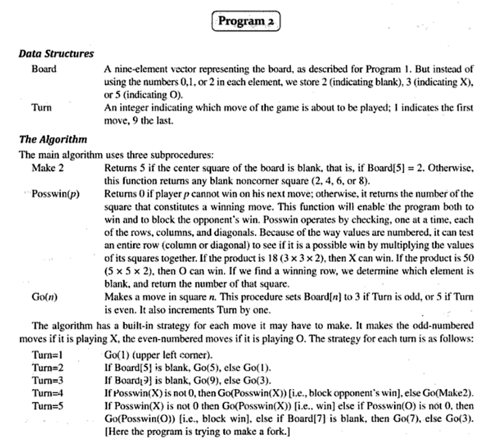
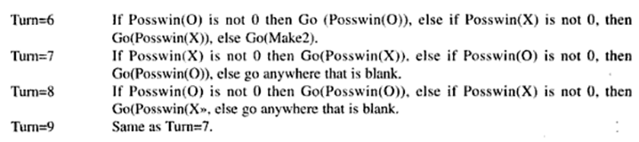
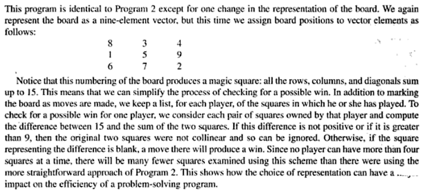
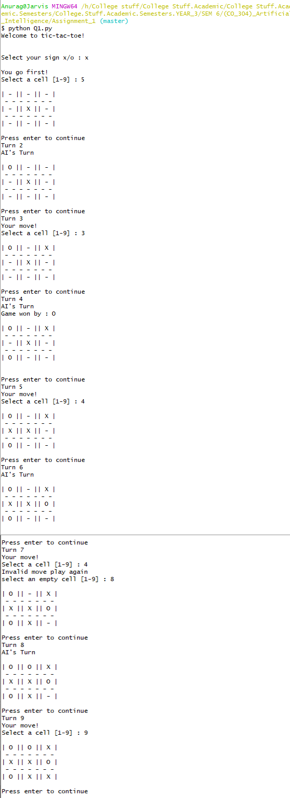
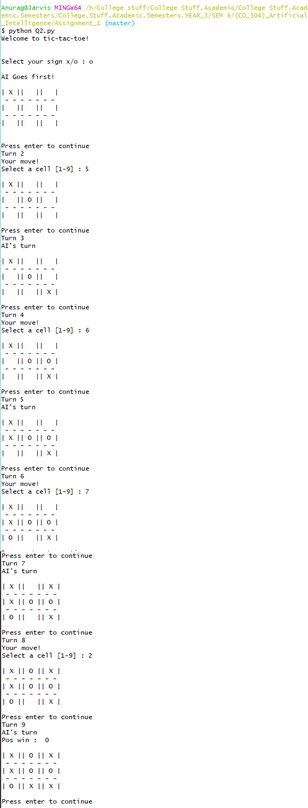

# Assignment 1

## Implement the Tic-Tac-Toe Solver AI technique.

## 1. Implement the normal implementation where blanks are 2, X's are 3 and O's are 5.

  
## 2. Implement the improved implementation where the grid is a magic square with the sum of 15.

The code is in [Q1.py](Q1.py) and [Q2.py](Q2.py)

## Program 1:

## Program 2:
