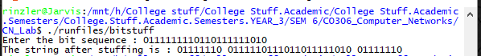

# AIM : To implement the data link layer framing methods such as Bit stuffing.

## Introduction and Theory:

Security and error detection are the most prominent features that are to be provided by the application which transfers data from one end to the other. One such mechanism in tracking errors which may add up to the original data during transfer is *"Stuffing"* . 

Stuffing is of two types: 

1) Bit stuffing 

2) Character stuffing

### Bit Stuffing

* In Bit-Stuffing a special bit pattern "01111110" is inserted at the start and end of the bit stream and the patterns are broken up by inserting '0s' at a set window (e.g 5). These newly inserted bits are non informative bits.
* Bit stuffing is used for various purposes, such as for bringing bit streams that do not necessarily have the same or rationally related bit rates up to a common rate, or to fill buffers or frames. The location of the stuffing bits is communicated to the receiving end of the data link, where these extra bits are removed to return the bit streams to their original bit rates or form. Bit stuffing may be used to synchronize several channels before multiplexing or to rate-match two single channels to each other

### De-Stuffing
* De-Stuffing refers to the retrieval of the original data from the received data. This is done by removing the special bit patterns and the stuffed bits.


## Algorithm:

```python
Stuffing (Input)
1. insert "01111110" into the input sequence.
2. Start with the original sequence.
3. for every 0:
4.    if it is followed by 6 1's:
5.    	Insert a 0 after the 5th one to break the sequence
6. insert "01111110" into the output sequence's end.
7. return the new sequence.
```

```python
DeStuffing (Input)
1. Neglect the initial Bit pattern
2. If a stuffed bit is found, neglect it; otherwise copy the input to output.
3. Neglect the trailing Bit pattern
4. end
```


## Code:

```c++
/*
 To implement bit stuffing and destuffing
 This implementation is unrestricted in terms of the size
 of input sequence.
  */
#include<iostream>
#include<string>
using namespace std;

int main()
{
	int len, count = 0 ;
	string S;
	cout << "Enter the bit sequence : ";
	cin >> S;
	len = S.length();
	int i = 0;
	while ( i != S.length() )
	{
		
		if (S[i] == '0')
			count = 0;
		if (S[i] == '1')
			count++;
		if (count == 5)
		{
			S.append("0");
			for ( int j = S.length() - 1 ; j > i+1 ; j--)
				S[j] = S[j-1];
			S[i+1] = '0';
			i++;
		}
		i++;
			
	}
	S = "01111110" + S;
	S = S + "01111110";
	cout << "The string after stuffing is ";
	cout << S << endl;

/* Performing destuffing */
	count = 0;
	string DeStuffed;
	//1. Neglect the starting 01111110
	S = S.substr(8);
	for (int i = 0 ; i < S.length() - 8 ; i++)
	{
		if (S[i] == '0')
		{
			DeStuffed += S[i];
			count = 0;
		}
		if ( S[i] == '1')
		{
			DeStuffed += S[i];
			count++;
		}
		if (count == 5)
		{
			i++;
			count = 0;
		}
	}

	cout << "The de-stuffed data is : ";
	cout << DeStuffed << endl;

	return 0;
}

```

## Output:



## Findings and Learnings:

1. Bit stuffing allows for the implementation of synchronous multiplexing.
2. It is also used in run length limited coding to limit the number of consecutive bits of the same value in the data to be transmitted. A bit of the opposite value is inserted after the maximum allowed number of consecutive bits.
3. To recover the original data from the stuffed signal, De-Stuffing is used.
4. Bit stuffing does not ensure that the payload is intact (*i.e.* not corrupted by transmission errors); it is merely a way of attempting to ensure that the transmission starts and ends at the correct places.

