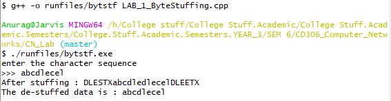

# AIM : To implement the data link layer framing methods such as Bit stuffing.

## Introduction and Theory:

Security and error detection are the most prominent features that are to be provided by the application which transfers data from one end to the other. One such mechanism in tracking errors which may add up to the original data during transfer is *"Stuffing"* . 

Stuffing is of two types: 

1) Bit stuffing 

2) Character stuffing

### Bit Stuffing

- Each frame starts with the ASCII character sequence DLE STX and ends with the sequence DLE ETX.(where DLE is Data Link Escape, STX is Start of TeXt and ETX is End of TeXt.) This method overcomes the drawbacks of the character count method. If the destination ever loses synchronization, it only must look for DLE STX and DLE ETX characters. 
- If binary data is being transmitted, then there exists a possibility of the characters DLE STX and DLE ETX occurring in the data. Since this can interfere with the framing, a technique called character stuffing is used. The sender's data link layer inserts an ASCII DLE character just before the DLE character in the data. The receiver's data link layer removes this DLE before this data is given to the network layer. However, character stuffing is closely associated with 8-bit characters and this is a major hurdle in transmitting arbitrary sized characters.

### De-Stuffing

- De-Stuffing refers to the retrieval of the original data from the received data. This is done by removing the special bit patterns and the stuffed bits.


## Algorithm:

```python
Stuffing (Input)
1. insert "DLESTX" into the input sequence.
2. Start with the original sequence.
3. for every char C in S:
4.    if C = ‘D’ and C+1 = ‘L’ and C+2 = ‘E’:
5.    	Insert a ‘DLE’ before C.
6. insert "DLE ETX" into the input sequence
7. return the new sequence.
```

```python
DeStuffing (Input)
1. Neglect the initial Bit pattern
2. If a stuffed bit is found, neglect it; otherwise copy the input to output.
3. Neglect the trailing Bit pattern
4. end
```


## Code:

```c++
/*
To implement byte/character stuffing and destuffing
 This implementation is unrestricted in terms of the size
 of input sequence.
 */

#include<iostream>
#include<string>

using namespace std;

int main()
{
	string in, out;
	cout << "enter the character sequence " 
      	 << endl 
         << ">>> ";
	cin >> in;
	out += "DLESTX";
	int len = in.length();

	for (int i = 0; i < len; i++)
	{
		if (in[i] == 'd' 
            && in[i + 1] == 'l' 
            && in[i + 2] == 'e')
          
			out += "dle";
			out += in[i];
	}

	out += "DLEETX";
	cout << "After stuffing : " << out << endl;

	in.clear();
	for(int i = 6; i < out.length()-6;i++)
	{
		if (out[i] == 'd' 
            && out[i + 1] == 'l' 
            && out[i + 2] == 'e')
          
		{
			i+=5;
			in += "dle";
		}
		else 
			in += out[i];
	}
	cout << "The de-stuffed data is : ";
	cout << in << endl;
	return 0;
}

```

## Output:



## Findings and Learnings:

1. It provides the same benefits as bit stuffing but at 8-bit/byte level.
2. To recover the original data from the stuffed signal, De-Stuffing is used.
3. One major drawback is, character stuffing is closely associated with 8-bit characters and this is a major hurdle in transmitting arbitrary sized characters.