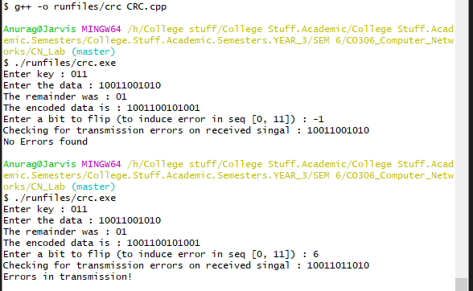

# AIM : To implement Cyclic Redundancy Check using Modulo-2 Division

## Introduction and Theory

A **cyclic redundancy check** (**CRC**) is an error-detecting code) commonly used in digital networks and storage devices to detect accidental changes to raw data. Blocks of data entering these systems get a short *check value* attached, based on the remainder of a polynomial division of their contents. On retrieval, the calculation is repeated and, in the event the check values do not match, corrective action can be taken against data corruption. 

CRCs are so called because the *check* (data verification) value is a *redundancy* (it expands the message without adding information and the algorithm is based on *cyclic* codes. CRCs are popular because they are simple to implement in binary hardware, easy to analyze mathematically, and particularly good at detecting common errors caused by noise in transmission channels. 

CRC uses **Generator Polynomial **which is available on both sender and receiver side. An example generator polynomial is of the form like x3 + x + 1. This generator polynomial represents key 1011. Another example is x2 + 1 that represents key 101.

The algorithm acts on the bits directly above the divisor in each step.  The result for that iteration is the bitwise XOR of the polynomial divisor with the bits above it.  The bits not above the divisor are simply copied directly below for that step.  The divisor is then shifted one bit to the right, and the process is repeated until the divisor reaches the right-hand end of the input row. 

The leftmost divisor bit zeroed every input bit it touched, when this process ends the only bits in the input row that can be nonzero are the n bits at the right-hand end of the row. These ''n'' bits are the remainder of the division step, and will also be the value of the CRC function (unless the chosen CRC specification calls for some post-processing).

## Algorithm

### Sender side

**Generation of Encoded Data from Data and Generator Polynomial (or Key):**

```python
Sender(Input, key)
	1. Add K-1 zeros to the end of input
    2. remainder = mod_2_division(input, key)
    3. append(data, remainder)
    4. return data.
```

#### example :

```mathematica
Sender:
Data : 100100
Key : 1101
1101|100100 000| 111101
	 1101
	  1000
	  1101
	   1010
	   1101
	    1110
	    1101
	     0110
	     0000
	      1100
	      1101
	       001
```

```mathematica
receiver:
Data : 100000001
Key : 1101
1101|100000001|111010
	 1101
	  1010
	  1101
	   1110
	   1101
	    0110
	    0000
	     1100
	     1101
	      0011
	      0000
	       011
Remainder != 0
Error in transmission.
```


### Receiver side

**Check if there are errors introduced in transmission**

```python
Receive(Input, key)
	1. remainder = mod_2_division(input, key)
    2. if ( remainder == 0)
    3.		return True #No errors
	4. else
    5. 		return False #Errors found
```

### Modulo-2 Binary Division

The process of modulo-2 binary division is the same as the process for decimal numbers. Instead of subtraction, we use XOR here.

``` python
Mod_2_Division()
	1. XOR a copy of divisor with K bits of dividend
	2. Use resulting n-1 bits are used for the next calculation. An extra bit is pulled down to make it n bits
	3. repeat 1, 2 till no bits are left. The resulting n-1 bits are the remainder.
	4. append remainder to the sender side.
	5. end
```


## Code

```c++
#include<iostream>
#include<string>

using namespace std;

string Xor(string a, string b)
{
	string result;
	for (int i = 1; i < b.length() ; i++)
	{
		if (a[i] == b[i])
			result.append("0");
		else
			result.append("1");
	}
	return result;
}

string mod2div( string divident, string divisor)
{
	int pick = divisor.length();
	string tmp;
	string zeros;
	for ( int i = 0; i < pick; i++)
	{
		tmp += divident[i];
		zeros += "0";
	}

	while (pick < divident.length())
	{
		if (tmp[0] == '1')
			tmp = Xor(divisor,tmp) + divident[pick];
		else
			tmp = Xor(zeros, tmp) + divident[pick];
		pick++;
	}

	if (tmp[0] == '1')
		tmp = Xor(divisor,tmp);
	else
		tmp = Xor(zeros,tmp);
	return tmp;
}

void encode( string data, string key)
{
	int key_len = key.length();
	string appended = data;
	for ( int i = 0 ; i < key_len - 1; i++)
	{
		appended.append("0");
	}
	string remainder = mod2div(appended, key);
	string coded = data + remainder;
	cout << "The remainder was : " << remainder << endl;

	cout << "The encoded data is : " << coded << endl;
}

bool check_error(string data, string key)
{
	int key_len = key.length();
	string appended = data;
	for ( int i = 0 ; i < key_len - 1; i++)
	{
		appended.append("0");
	}
	string remainder = mod2div(appended, key);
	for (int i = 0 ; i < remainder.length() ; i++)
		if (remainder[i] == '1')
			return false;
	return true;
}

int main()
{
	string data, key;
	cout << "Enter key : ";
	cin >> key;
	cout << "Enter the data : ";
	cin >> data;
	encode(data,key);
	int flip;
	cout << "Enter a bit to flip (to induce error in seq [0, " << data.length() <<"]) : ";
	cin >> flip;
	if (flip > -1 && flip < data.length())
	{
		if (data[flip] == '1')
			data[flip] = '0';
		else
			data[flip] = '1';
	}
	cout << "Checking for transmission errors on received singal : " << data << endl;
	if (check_error(data,key))
		cout << "Errors in transmission!" << endl;
	else 
		cout << "No Errors found" << endl;
	return 0;
}
	


```


## Output




## Findings and Learnings

1. The modulo 2 CRC check algorithm can be used to check of error in transmission over noisy mediums.
2. Due to it's simplicity in working it can easily be implemented into binary hardware logics.
3. As it is a check using cyclic codes it can be used as a redundancy measure.