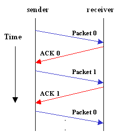
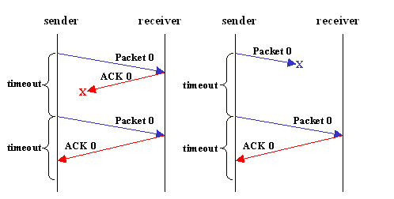
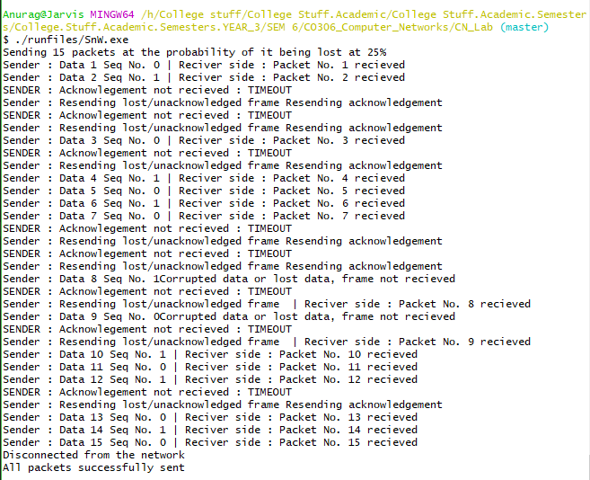

# AIM : To implement Stop and Wait Protocol 

## Introduction and Theory

*stop-n-wait* (sometimes known as "positive acknowledgement with retransmission")  is the fundamental technique to provide reliable transfer under unreliable packet delivery system. 
1. If error is detected by receiver, it discards the frame and send a negative ACK (NAK), causing sender to re-send the frame 
2. In case a frame never got to receiver, sender has a timer: each time a frame is sent, timer is set If no ACK or NAK is received during timeout period, it re-sends the frame
3. Timer introduces a problem: Suppose timeout and sender retransmits a frame but receiver actually received the previous transmission → receiver has duplicated copies 
4. To avoid receiving and accepting two copies of same frame, frames and ACKs are alternatively labeled 0 or 1: ACK0 for frame 1, ACK1 for frame 0

This method implements both, Flow control and Error control. It works in the following way:

### Normal Operation
After transmitting one packet, the sender waits for an acknowledgment (ACK) from the receiver before transmitting the next one. In this way, the sender can recognize that the previous packet is transmitted successfuly and we could say "stop-n-wait" guarantees reliable transfer between nodes. 
To support this feature, the sender keeps a record of each packet it sends.  
Also, to avoid confusion caused by delayed or duplicated ACKs, "stop-n-wait" sends each packets with unique sequence numbers and receives that numbers in each ACKs. 


### Timeout 
If the sender doesn't receive ACK for previous sent packet after a certain period of time, the sender times out and retransmits that packet again. There are two cases when the sender doesn't receive ACK; One is when the ACK is lost and the other is when the frame itself is not transmitted. 
To support this feature, the sender keeps timer per each packet.


The main shortcoming of the stop-and-wait algorithm is that it allows the sender to have only one outstanding frame on the link at a time. The sender should wait till it gets an ACK of previous frame before it sends next frame. As a result, it wastes a substantial amount of network bandwidth.


## Algorithm

### Sender side

```python
def Sender():
    1. frame S # Buffer for the outbound frame
    2. packet buffer # Buffer for the outbound packet
    3. event_type # Event type
    4. while(True):
    5.     from_network_layer(buffer) # get something to send
    6.     S.info = buffer # load data into the frame
    7.     to_phy_layer(S) # send file
    8.     wait_for_event(event) # wait now
```


### Receiver side

```python
def Receive():
    1. frame R, S # buffer frames
    2. event_type # event type
    3. while(True):
    4.     wait_for_event(event) # wait for sender to send something and it reaching
    5.     from_phy_layer(R) # read in the data
    6.     to_net_layer(R.info) # pass the data to the network layer
    7.     to_phy_layer(s) # send dummy packer to awaken sender (ack)
```

## Code

```c++
#include<windows.h>
#include<stdlib.h>
#include<iostream>
using namespace std;
#define TOUT 5
#define M_Seq 1
#define M_Pack 15
//#define increment(k) if(k<M_Seq) k++; else k = 0;

void increment(int &k)
{
	if (k < M_Seq)
		k++;
	else
		k = 0;
}
enum event_type
{
	frame_arr, error, t_out, no_e
};

struct packet
{
	int data;
};

struct frame
{
	int type;
	int seq;
	int acc;
	packet inf;
	int error;
};

frame DATA;

int i = 1; //To hold seq numbers
char turn; //To switch between sender and receiver 
int dc = 0; //To check if connection should be terminated or not.

void from_net_layer(packet &bff)
{
	bff.data = i;
	i++;
}

void to_phy_layer(frame &s)
{
	s.error = rand() % 4; //The probability of getting an error is 0.10
	DATA = s; // The data is now on the physical layer
}

void to_net_layer(packet &bff)
{
	cout << " | Reciver side : Packet No. " << bff.data << " recieved" << endl;
	if (i > M_Pack)
	{
		dc = 1;
		cout << "Disconnected from the network" << endl;
	}
}

void from_phy_layer(frame &bff)
{
	bff = DATA;
}

void Wait_Sender_event(event_type &e)
{
	static int timer = 0;

	if (turn == 's')
	{
		timer++;
		if (timer == TOUT)
		{
			e = t_out;
			cout << "SENDER : Acknowlegement not recieved : TIMEOUT" << endl;
			timer = 0;
			return;
		}
		if (DATA.error == 0)
			e = error;
		else
		{
			timer = 0;
			e = frame_arr;
		}
	}
}

void Wait_Reciever_event(event_type &e)
{
	if (turn == 'r')
	{
		if (DATA.error == 0)
			e = error;
		else
			e = frame_arr;
	}
}

void sender()
{
	static int to_send = 0;
	static frame s;
	packet bff;
	event_type event;
	static int flag = 0;

	if (flag == 0)
	{
		from_net_layer(bff);
		s.inf = bff;
		s.seq = to_send;

		cout << "Sender : Data " << s.inf.data << " Seq No. " << s.seq;
		turn = 'r';
		to_phy_layer(s);
		flag = 1;
	}

	Wait_Sender_event(event);

	if (turn == 's')
	{
		if (event == frame_arr)
		{
			from_net_layer(bff);
			increment(to_send);
			s.inf = bff;
			s.seq = to_send;
			cout << "Sender : Data " << s.inf.data << " Seq No. " << s.seq;
			turn = 'r';
			to_phy_layer(s);
		}
		if (event == t_out)
		{
			cout << "Sender : Resending lost/unacknowledged frame ";
			turn = 'r';
			to_phy_layer(s);
		}
	}
}

void reciever()
{
	static int expected = 0;
	frame r, s;
	event_type event;

	Wait_Reciever_event(event);

	if (turn == 'r')
	{
		if (event == frame_arr)
		{
			from_phy_layer(r);
			if (r.seq == expected)
			{
				to_net_layer(r.inf);
				increment(expected);
			}
			else
				cout << "Resending acknowledgement" << endl;
			turn = 's';
			to_phy_layer(s);

		}

		if (event == error)
		{
			cout << "Corrupted data or lost data, frame not recieved" << endl;
			turn = 's';
		}
	}
}

int main()
{
	cout << "Sending 15 packets at the probability of it being lost at 25\%" << endl;
	while (!dc)
	{
		sender();
		Sleep(200);
		reciever();
	}
	cout << "All packets successfully sent" << endl;
	return 0;
}
	

```


## Output




## Findings and Learnings

1. For noisy link, pure stop and wait protocol will break down, and solution is to incorporate someerror control mechanism.
2. The main shortcoming of the stop-and-wait algorithm is that it allows the sender to have only one outstanding frame on the link at a time. The sender should wait till it gets an ACK of previous frame before it sends next frame. As a result, it wastes a substantial amount of network bandwidth.
3. Stop and Wait ARQ may work fine where propagation delay is very less for example LAN connections, but performs badly for distant connections like satellite connection.