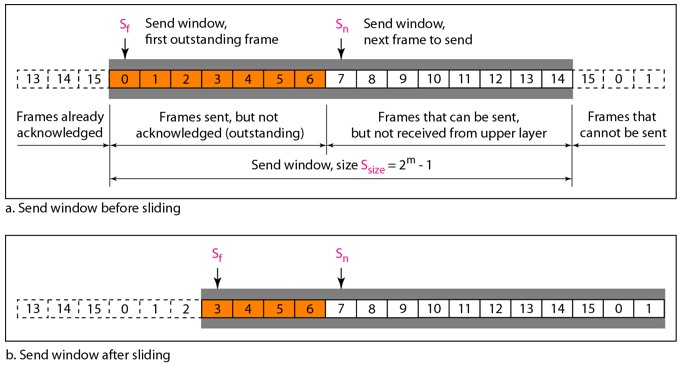
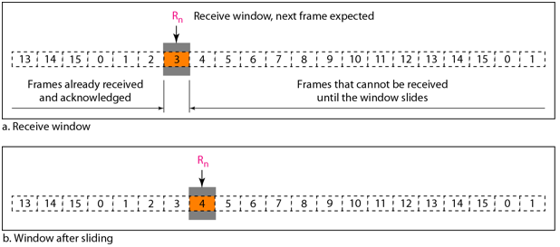
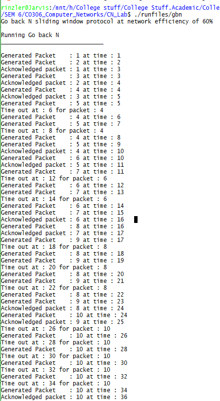

# AIM : To implement Sliding Window Go-Back-N Protocol

## Introduction and theory

This is a fundamental technique provided either by the network layer but in general by the transport layer for the reliable transfer of packets under unreliable packet delivery system.

This improves the efficiency of the Stop and Wait protocol by having multiple packets in transition while the sender is waiting for acknowledgement. We send several packets before receiving acknowledgement from the receiver, to do this a copy of the sent packet is maintained.In the Go-Back-N Protocol, the sequence numbers are modulo 2m, where m is the size of the sequence number field in bits.

The send window is an abstract concept defining an imaginary box of size 2m
− 1 with three variables: Sf, Sn, and Ssize. The send window can slide one or more slots when a valid acknowledgment arrives.



The receive window is an abstract concept defining an imaginary box of size 1 with one single variable  Rn. The window slides when a correct frame has arrived;sliding occurs one slot at a time.



The stop and wait protocol is basically a special case of Go-Back-N with the window size set to 1.

## Algorithm

### Sender Side

``` python
1. Sw = 2M-1
2. sf = 0
3. sn = 0
4.
5. while(True):
6.     WaitForEvent()
7.     if(Event(RequestToSend())):
8.         if( sn - sf > sw):
9.             Sleep()
10.         GetData()
11.         MakeFrame()
12.         StoreFrame()
13.         SendFrame()
14.         Sn = Sn + 1
15.         if (Timer not running):
16.             StartTimer()
17.     if(Event(ArrivalNotif)):
18. 		Receive(ACK)
19.			if(Corrupted(ACK)):
20.				Sleep()
21. 		if((AckNo>Sf) and (AckNo <= Sn)):
22.				while(Sf<AckNo):
23. 				PurgeFrame(Sf)
24.					Sf = Sf + 1
25. 			StopTimer()
26. 	if(Event(TimeOut)):
27.			StartTimer()
28. 		Temp = Sf
29. 		while(Temp < Sn):
30.				SendFrame(Sf)
31.				Sf = Sf + 1
        
```


### Receiver Side

```python
1. Rn = 0
2. while(True):
3. 		WaitForEvent()
4. 		if(Event(ArrivalNotif)):
5.			ReceiveFrame()
6.			if(Corrupted(Frame)):
7. 				Sleep()
8. 			if(SeqNo == Rn):
9. 				DeliverData()
10.				Rn = Rn + 1
11. 			SendAck(Rn)
```

## Code

```c++
#include <iostream>
#include <stdlib.h>
#include <time.h>
using namespace std;
#define EFF 60 // Network efficiency
#define GEN 1 // frequency at which a pakcet is generated.
#define TRN 1 // Transmission time of medium
#define TOUT 2 // Timeout window for the sender
// Time counter for sync
int SysTime = 0;

int LastAckRec;  // The lasy acknowledgement thats been received.

int numberPacketsLost;

int sender[10][4];
// Sender Window Pointer
/* sender[n][0] is packet no.
sender[n][1] is send time of packet.
sender[n][2] is the ack time of packet
sender[n][3] is the timeout time.
*/
int SWPToSend = 0;
int SWPToReceive = 0;


// Packet generator 
void generate(int genTime, int packetNo)
{
	if (packetNo<11)
		cout << "Generated Packet    : " << packetNo << " at time : " << genTime << endl;

	sender[SWPToSend][0] = packetNo;
	sender[SWPToSend][1] = genTime;
	sender[SWPToSend][2] = 0;
	sender[SWPToSend][3] = 0;


	int randTemp = rand() % 100;
	if (randTemp<numberPacketsLost)
	{
		sender[SWPToSend][3] = genTime + TOUT; // packet is lost.
	}
	else
	{
		sender[SWPToSend][2] = genTime + 2 * TRN; // packet reaches safely.
	}

}

void goBack()
{
	//Building the senderWindow
	for (int i = 0; i<10; i++)
	{
		for (int j = 0; j<4; j++)
		{
			sender[i][j] = 0;
		}
	}

	int packetNumber = 1;
	while (true)
	{
		bool TOUTOcc = false;
		if (sender[SWPToReceive][2] <= SysTime + GEN && sender[SWPToReceive][2] != 0)
		{
			//Sending ack
			cout << "Acknowledged packet : " << sender[SWPToReceive][0] << " at time : " << sender[SWPToReceive][2] << endl;
			if (sender[SWPToReceive][0] == 10)
				break;
			SWPToReceive = (SWPToReceive + 1) % 10;

		}
		else if (sender[SWPToReceive][3] <= SysTime + GEN&&sender[SWPToReceive][3] != 0)
		{
			// Timeout detected.
			cout << "Time out at : " << sender[SWPToReceive][3] << " for packet : " << sender[SWPToReceive][0] << endl;
			SWPToSend = SWPToReceive;
			packetNumber = sender[SWPToReceive][0];
			TOUTOcc = true;
		}

		SysTime = SysTime + GEN;

		if (TOUTOcc)
		{
			SysTime = sender[SWPToReceive][3];
		}


		if (sender[SWPToReceive][0] == 0)
		{
			generate(SysTime, packetNumber);
			packetNumber++;
			SWPToSend = (SWPToSend + 1) % 10;
		}
		else if (sender[(SWPToSend - 1 + 10) % 10][0]<11)
		{
			generate(SysTime, packetNumber);
			packetNumber++;
			SWPToSend = (SWPToSend + 1) % 10;
		}

	}
}

int main()
{
	cout << "Go back N sliding window protocol at network efficiency of 60%" << endl;

	numberPacketsLost = 100 - (int)EFF;

	cout << endl << "Running Go back N" << endl;
	for (int i = 0; i<30; i++)
		cout << "_";

	cout << endl << endl;
	goBack();

	return 0;
}
```


## Output



## Findings and Learnings

1. On mediums which are prone to high errors, it wastes a lot of bandwidth retransmitting frames.
2. When packets sizes are very large  it may require very big buffers at the sender side to store them.
3. One works well on mediums with low transmissions delays.

