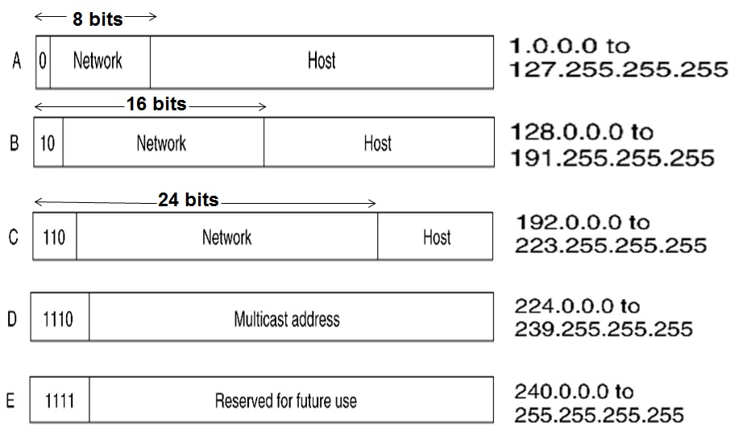

# AIM : To analyze a given IPv4 address and find its host and net IDs

## Introduction and theory

Internet Protocol version 4 (IPv4) is the fourth version in the development of the Internet Protocol (IP) and the first version of the protocol to be widely deployed

Communication between hosts can happen only if they can identify each other on the network. In a single collision domain (where every packet sent on the segment by one host is heard by every other host) hosts can communicate directly via MAC address. A logical address is given to all hosts connected to Internet and this logical address is called **Internet Protocol Address**.

Internet Protocol is one of the major protocols in the TCP/IP protocols suite. This protocol works at the network layer of the OSI model and at the Internet layer of the TCP/IP model. Thus this protocol has the responsibility of identifying hosts based upon their logical addresses and to route data among them over the underlying network.

IPv4 uses hierarchical addressing scheme. An IP address, which is 32-bits in length.

In class based IP address types, the set of IP addresses are segregated into  5 classes of IP address families, namely class A, class B, class C, class D and class E

Internet Protocol hierarchy contains several classes of IP Addresses to be used efficiently in various situations as per the requirement of hosts per network. Broadly, the IPv4 Addressing system is divided into five classes of IP Addresses. All the five classes are identified by the first octet of IP Address.



The above method of classification is based on two things,

- namely a unique binary prefix for each class (for e.g. all Class D addresses start with the prefix 1110) and
- the number of bits allocated to the network portion (Class A has the first byte reserved for network portion, Class B has the first two bytes reserved for the network portion and class C has the first three bytes reserved for the network portion). So Class A is generally used for big networks with large number of hosts (24 bits allotted to host), class B for medium sized networks and Class C for small networks.
- While Class A, B and C are used for normal Unicast communication, Class D addresses are reserved for multicast communication and Class E is reserved for future use and experimentation purposes.


## Algorithm

``` python
1. class = GetClass(ip_address)
2. switch(class):
3.		case 'A' : net_id = bits(ip_address,24, 32), host = bits(ip_address, 0, 24)
4. 		case 'B' : net_id = bits(ip_address,16, 32), host = bits(ip_address, 0, 16)
5. 		case 'C' : net_id = bits(ip_address,8, 32), host = bits(ip_address, 0, 8)
6. 		case 'D' :
7. 		case 'E' : net_id = -1
8. if net_id != -1:
9. 		print(net_id, host_id)
10. else:
11. 	print('D/E class dont have Host/Net IDs')
```

## Code

```c++
#include <iostream>
#include <string>
#include <stdlib.h>
#include <sstream>
#include <time.h>
using namespace std;

char GetClass(string S)
{
    int i = 0;
    while(S[i] != '.')
        i++;
    i--;
    
    int ip = 0;
    int j = 1;
    while (i >= 0)
    {
        ip += (S[i] - '0') * j;
        j *= 10;
        i--;
    }
    // Class A
    if (ip >=1 && ip <= 126)
        return 'A';
 
    // Class B
    else if (ip >= 128 && ip <= 191)
        return 'B';
 
    // Class C
    else if (ip >= 192 && ip <= 223)
        return 'C';
 
    // Class D
    else if (ip >= 224 && ip <= 239)
        return 'D';
 
    // Class E
    else
        return 'E';
    
}

void GetIDs(string S, char IpClass)
{
    string NetID, HostID;

    if (IpClass == 'A')
    {
        int j = 0;
        while(S[j] != '.')
            NetID += S[j++];
        j++;
        while (j < S.length())
            HostID += S[j++];

        cout << "Network ID : " << NetID << endl;
        cout << "Host ID    : " << HostID << endl;
    }

    else if (IpClass == 'B')
    {
        int j = 0, dc = 0;
        while( dc < 2)
        {
            NetID += S[j++];
            if (S[j] == '.')
                dc++;
        }
        j++;

        while( j < S.length())
            HostID += S[j++];
        cout << "Network ID : " << NetID << endl;
        cout << "Host ID    : " << HostID << endl;
    }

    else if (IpClass == 'C')
    {
        int j = 0, dc = 0;
        while( dc < 3)
        {
            NetID += S[j++];
            if (S[j] == '.')
                dc++;
        }
        j++;

        while( j < S.length())
            HostID += S[j++];
        cout << "Network ID : " << NetID << endl;
        cout << "Host ID    : " << HostID << endl;
    }

    else
    {
        cout << "IP : " << S << " is of Class D/E " << endl;
        cout << "Classes D and E don't have Network and Host IDs " << endl;
}
    }
        

int main()
{
    int t;
    string S;
    char Class;
    srand (time(NULL));    
    cout << "Enter how many IPv4 addresses to test : ";
    cin >> t;
    while (t--)
    {
        for(int i = 0 ; i < 4 ; i ++)
        {
            ostringstream st;
            st << rand()%256;
            S += st.str();
            if( i < 3)
                S += '.';
        }

        Class = GetClass(S);
        cout <<"IP Address : " << S << endl << "IPv4 Class : " << Class << endl;
        GetIDs(S, Class);
        cout << endl;
        S.clear();
    }
}
```


## Output


## Findings and Learnings

1. IPv4 is a connectionless protocol for use on packet-switched networks. It operates on a best effort delivery model, in that it does not guarantee delivery, nor does it assure proper sequencing or avoidance of duplicate delivery.
2. IPv4 addresses may be represented in any notation expressing a 32-bit integer value. They are most often written in the dot-decimal notation, which consists of four octets of the address expressed individually in decimal numbers and separated by periods.
3. To overcome under utilization of IP addresses in class based systems, classless addresses have been proposed.

