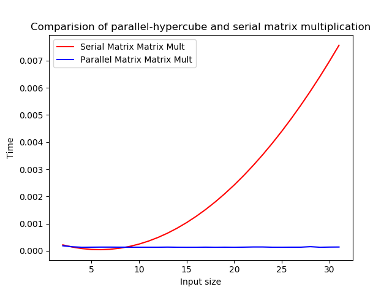

# AIM: To implement SIMD Matrix-Matrix multiplication using Hypercube architecture

## Introduction and Theory

Matrix-Matrix Multiplication can be parallelized using the hypercube architecture of SIMD models. This uses N3 processors where N is the input size of the two matrices. These are arranged into a 2(q) dimensional cube of processors. All of these are equidistant from each other to minimize the propagation losses.

The arrangement of the processors are as follows:


This method has 3 steps:

1. distribute the data to all the n**3 processors, this takes log(n) time.
2. perform multiplication of the two numbers in each processor, this is a constant time operation.
3. Add up all the matrixes in the cubes to get the final Matrix, depending upon the implementation this can take O(n) or O(log(n)) time.

Thus theoretically the hypercube approach is the not most cost optimal and best possible method.

## Algorithm

```python
1. def CubeMMM(A, B, C):
2. 		Distribute A, B to n3 processors such that A(i,j,k) = ajk and B(i,j,k) = bik
3. 		Compute the products C(i,j,k) = A(i,j,k) * B(i,j,k)
4. 		The sums i=0simn-1 (C(i,j,k)).
    
```

## Code

```python
import threading as th
from util import GetMatrix, mat_print, MinMaxScale
import time
import matplotlib.pyplot as plt
import numpy as np
from Lab_2_matmult import Multiply

def mult(A, B, C, i, j, k):
    C[i][j][k] = A*B
    pass
def main():
    st = int(input("Enter the starting size : "))
    ed = int(input("Enter the endibg size : "))
    s_x = []
    s_y = []
    p_x = []
    p_y = []

    for z in range(st,ed):
        A = GetMatrix(z)
        B = GetMatrix(z)
        V = []
        print("Generated Matrix A")
        mat_print(A)
        print("Generated Matrix V")
        mat_print(B)
        s = time.time()
        C = Multiply(A,B)
        e = time.time()        
        print ('Result using n3 algorithm')
        mat_print(C)
        s_x.append(z)
        s_y.append(e-s)
        C_p = [[[0 for i in range(z)]for j in range(z)] for k in range(z)]
        # print(C_p)
        nproc = z**3
        procs = []
        for i in range(z):
            tprocs = []
            for j in range(z):
                tt_proc = []
                for k in range(z):
                    tt_proc.append(th.Thread(target=mult, args = (A[j][i], B[i][k], C_p, i, j, k)))
                    # print ('C[{}][{}][{}] = {}, {}'.format(i, j , k, A[j][i], B[i][k]), end = ' ')
                tprocs.append(tt_proc)
                # print()
            procs.append(tprocs)

        e1 = time.time()
        for _2 in procs:
            for _1 in _2:
                for i in _1:
                    i.start()
        s1 = time.time()
        for _2 in procs:
            for _1 in _2:
                for i in _1:
                    i.join()
        # Mult step done:
        C = [[0 for i in range(z)] for i in range(z)]
        e2 = time.time()
        for i in range(z):
            for j in range(z):
                # print('C[{}][{}] = sum('.format(i, j), end = ' ')
                for k in range(z):
                    C[j][i] += C_p[k][j][i]
                #     print(C_p[k][j][i], end = ' ')
                # print()
        s2 = time.time()
        p_x.append(z)
        p_y.append(((s1-e1) + (s2-e2))/z**3)
        print ('Result using cube algorithm')
        mat_print(C)
    # s_y = MinMaxScale(s_y)
    # p_y = MinMaxScale(p_y)
    s_fit = np.polyfit(s_x, s_y,deg=2 )
    s_p = np.poly1d(s_fit)
    plt.plot(s_x,s_p(s_x), label="Serial Matrix Matrix Mult", color = 'red')
    plt.plot(p_x,p_y, label="Parallel Matrix Matrix Mult",color = 'blue')
    plt.xlabel('Input size')
    plt.ylabel('Time')
    plt.title("Comparision of parallel-hypercube and serial matrix multiplication")
    plt.legend()
    plt.show()
    s_up = [s_y[i]/p_y[i] for i in range(len(s_x))]
    plt.plot(s_x, s_up, label="speed up")
    plt.show()
                    

main()
```

## Output


## Discussion

From the graph below we see that the time taken for parallel implementation stays nearly constant time compared to the serial implementation.



## Findings and learnings 

1. The parallel methods shows better performance at very high order of input
2. The initial overhead of process allocation and scheduling makes it impractical for small inputs
3. After n=10 the growth of parallel method is nearly constant which is expected.