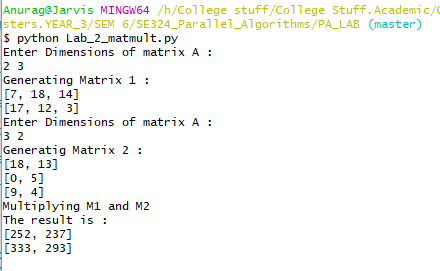
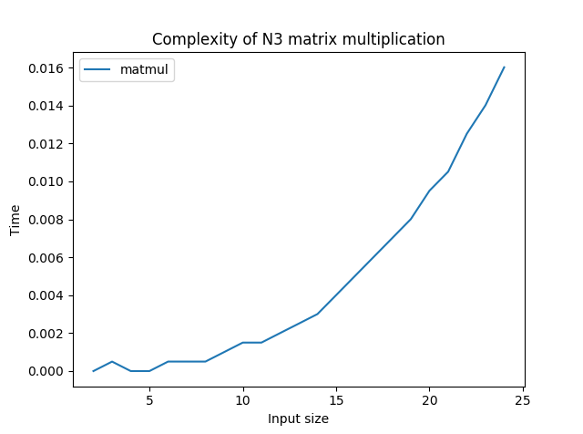

# AIM: To implement and analyze serial Matrix-Matrix multiplication.

## Introduction and Theory

The task of matrix multiplication is widely used in the field of computer science as an optimization technique via vectorization. It is also used in the field of graphics where the images/segments of images are stored as matrices (2D arrays). Thus the need of an efficient algorithm to multiply matrices is essential. The standard algorithm of said task is O(n3) w.r.t size of input and the best possible serial time is given by Coppersmith-Winograd algorithm with a complexity of O(n2.3737).

This is the matrix-matrix multiplication task.


The basic requirement for matrix-matrix multiplication is that the number of columns in Matrix 1 should be equal to the number of rows in Matrix 2 and the resulting product is of size M x N if M1 is of MxN and M2 is of NXM.

## Algorithm 

```python
def Mat_Mul (M1[m][n], M2[n][m]):
1.	res = [m][n]
2.	for i in [0,n]:
3.		for j in [0,n]:
4.			res[i][j] = 0
5.			for k in [0,n]:
6.				res[i][j] += M1[i][k] * M2[k][j]
7. return res
```

Complexity: There are 3 nested for loops each running N times => O(n3).


## Code

```python
import random

def GetMatrix(m1,m2):
    mat = []
    for i in range(m1):
        mat.append(random.sample(range(25),m2))
    return mat

def Multiply(M1, M2):
    if( len(M1[0]) != len(M2)):
        print("Incompatible Matrices, returning Null")
        return None
    res = []
    for i in range(len(M1)):
        res.append([0 for j in range(len(M2[0]))])

    for i in range(len(M1)):
        for j in range(len(M2[0])):
            res[i][j] = 0
            for k in range(len(M1[0])):
                res[i][j] += M1[i][k]*M2[k][j]
    return res

def main():
    print("Enter Dimensions of matrix A : ")
    m1,m2 = map(int, input().split())
    print("Generating Matrix 1 :")
    M1 = GetMatrix(m1,m2)
    for i in M1:
        print(i)
    print("Enter Dimensions of matrix B : ")
    m1,m2 = map(int, input().split())
    print("Generatig Matrix 2 : ")
    M2 = GetMatrix(m1,m2)
    for i in M2:
        print(i)
    print("Multiplying M1 and M2")
    res = Multiply(M1, M2)
    print("The result is : ")
    for i in res:
        print(i)

if __name__ == '__main__':
    main()
```


## Output



## Discussion 

From the below graph we can see the algorithm indeed follows a N3 growth in time. and thus there is scope for parallelization to improve efficiency and run time.



## Findings and Learnings

1. The Matrix multiplication algorithm is a N3 algorithm w.r.t input size.
2. For the matrices to be multipliable their columns and rows need to be of same dimension
3. Due to independence of operations between rows and columns there's scope of parallelization.


