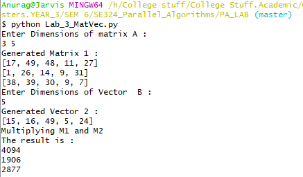
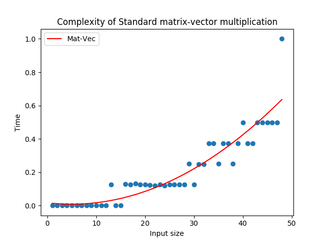

# AIM: To implement and analyze serial Matrix-Vector multiplication 

## Introduction and theory

The task of matrix-vector multiplication is widely used in the field of computer science especially in the field of scientific computing. It is also used in cognitive tasks like those in machine learning and other AI activities .Thus the need of an efficient algorithm to multiply matrices and Vectors is essential. The standard serial algorithm is O(n2) w.r.t to the input and this is also the best possible time for serial implementations.

The task is as follows:


The basic requirement for matrix-vector multiplication is that the number of columns in Matrix 1 should be equal to the number of rows in Vector and the resulting product is a vector of the same size of that of the rows in input.

## Algorithm

```python
def Mat_Vec(M[m][n],v[n]):
1.	res = int[m]
2.	for i in [0,m]:
3.		res [i] = 0
4.		for j in [0,n]:
5.			out[i] += M[i][j] * v[j]
6.	return res
```

Complexity: There are 2 nested for loops each running for M and N iterations respectively => O(mn) or O(n2) for square matrix.

## Code

```python
import random

def GetMatrix(m1,m2):
    mat = []
    for i in range(m1):
        mat.append(random.sample(range(50),m2))
    return mat

def GetVector(m1):
    mat = []
    mat = random.sample(range(50),m1)
    return mat

def Multiply(M1, M2):
    if( len(M1[0]) != len(M2)):
        print("Incompatible Matrices, returning Null")
        return None
    res = []
    for i in range(len(M1)):
        res.append(0)

    for i in range(len(M1)):
        res[i] = 0
        for j in range(len(M2)):
            res[i] += M1[i][j]*M2[j]
    return res

def main():
    print("Enter Dimensions of matrix A : ")
    m1,m2 = map(int, input().split())
    print("Generated Matrix 1 :")
    M1 = GetMatrix(m1,m2)
    for i in M1:
        print(i)
    print("Enter Dimensions of Vector  B : ")
    m1 = int(input())
    print("Generated Vector 2 : ")
    M2 = GetVector(m1)
    print(M2)
    print("Multiplying M1 and M2")
    res = Multiply(M1, M2)
    print("The result is : ")
    for i in res:
        print(i)

if __name__ == '__main__':
    main()
```


## Output



## Discussion

From the below graph we can see the algorithm indeed follows a N2 growth in time. and thus there is scope for parallelization to improve efficiency and run time.



## Findings and Learnings

1. The Matrix-Vector multiplication algorithm is a N2 algorithm w.r.t input size.
2. For the matrices and vectors to be multipliable their columns and rows need to be of same dimension
3. Due to independence of operations between rows and columns there's scope of parallelization.

