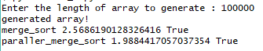

# AIM: To implement and analyze serial and parallel merge sort algorithm.

## Introduction and Theory

Merge sort is a divide-and-conquer algorithm based on the idea of breaking down a list into several sub-lists until each sublist consists of a single element and merging those sublists in a manner that results into a sorted list.

**Idea:**

- Divide the unsorted list into NN sublists, each containing N/2 element.
- Take adjacent pairs of two singleton lists and merge them to form a list of 2 elements. NN will now convert into N/2N/2 lists of size 2.
- Repeat the process till a single sorted list of obtained.

While comparing two sublists for merging, the first element of both lists is taken into consideration. While sorting in ascending order, the element that is of a lesser value becomes a new element of the sorted list. This procedure is repeated until both the smaller sublists are empty and the new combined sublist comprises all the elements of both the sublists.

The process is illustrated below


>source : Hackerearth

### Parallel Merge sort

The divide step makes that segment of the list an independent piece till its merged back. Thus it is parallelized.

## Algorithm

```
MergeSort(arr[], l,  r)
If r > l
     1. Find the middle point to divide the array into two halves:  
             middle m = (l+r)/2
     2. Call mergeSort for first half:   
             Call mergeSort(arr, l, m)
     3. Call mergeSort for second half:
             Call mergeSort(arr, m+1, r)
     4. Merge the two halves sorted in step 2 and 3:
             Call merge(arr, l, m, r)
```

Complexity (Serial): O(nLogn)

## Code

```python
import time
import random
import multiprocessing
import math
import matplotlib.pyplot as plt
import numpy as np

def merge(*args):
    left, right = args[0] if len(args) == 1 else args
    llft = len(left)
    lrgt = len(right)
    lin, rin = 0, 0

    merged = []

    while (lin < llft and rin < lrgt):
        if (left[lin] <= right[rin]):
            merged.append(left[lin])
            lin += 1
        else:
            merged.append(right[rin])
            rin += 1
    if lin == llft :
        merged.extend(right[rin:])
    else:
        merged.extend(left[lin:])
    return merged 
    
def merge_sort(arr):
    length = len(arr)
    if length <= 1 : return arr
    m = int(length//2)
    left = arr[0:m]
    right = arr[m:]
    left = merge_sort(left)
    right = merge_sort(right)
    return merge(left, right)

def paraller_merge_sort(arr):
    processes = multiprocessing.cpu_count()
    pool = multiprocessing.Pool(processes=processes)
    size = int(math.ceil(float(len(arr)) / processes))
    arr = [arr[i * size:(i + 1) * size] for i in range(processes)]
    arr = pool.map(merge_sort, arr)
    # Each partition is now sorted - we now just merge pairs of these
    # together using the worker pool, until the partitions are reduced
    # down to a single sorted result.
    while len(arr) > 1:
        # If the number of partitions remaining is odd, we pop off the
        # last one and append it back after one iteration of this loop,
        # since we're only interested in pairs of partitions to merge.
        extra = arr.pop() if len(arr) % 2 == 1 else None
        arr = [(arr[i], arr[i + 1]) for i in range(0, len(arr), 2)]
        arr = pool.map(merge, arr) + ([extra] if extra else [])
    return arr[0]

def main():
    # n = int(input("Enter the length of array to generate : "))
    # arr = random.sample(range(100000), n)
    # print ("generated array!")
    # for sort in merge_sort, paraller_merge_sort:
    #     start = time.time()
    #     arr_sorted = sort(arr)
    #     end = time.time() - start
    #     print (sort.__name__, end, sorted(arr) == arr_sorted)
    s_x = []
    s_y = []
    p_x = []
    p_y = []
    for i in range(10000,100000,5000):
        arr = random.sample(range(100000),i)
        start = time.time()
        arr_sorted = merge_sort(arr)
        end = time.time() - start
        s_x.append(i)
        s_y.append(end)

        start = time.time()
        arr_sorted = paraller_merge_sort(arr)
        end = time.time() - start
        p_x.append(i)
        p_y.append(end)
        print("Done itr : ",i)
    s_fit = np.polyfit(s_x, s_y,deg=2)
    s_p = np.poly1d(s_fit)
    p_fit = np.polyfit(p_x, p_y,deg=2)
    p_p = np.poly1d(p_fit)
    plt.plot(s_x,s_y, label="Serial Merge sort", color = 'red')
    plt.plot(s_x,s_p(s_x), linestyle="dotted", color = 'red')
    plt.plot(p_x,p_y, label="Parallel Merge sort")
    plt.plot(p_x,p_p(p_x), linestyle="dotted")
    plt.xlabel('Input size')
    plt.ylabel('Time')
    plt.title("Comparision on parallel and serial merge sort")
    plt.legend()
    plt.show()

if __name__ == '__main__':
    main()
```

## Output




## Discussion

From the graph below we can see that compared to the serial version the rate of growth of parallel implementation is much lower. It can also be seen that the time taken at lower input sizes in parallel is much larger than serial, this is due to the serial merge step and the resource allocation overhead.


## Findings and Learnings

1. The parallel merge sort algorithms has a lower growth rate at higher order of input
2. The initial high overhead of parallel version causes it to take a longer time for small input.
3. The graphs show that parallel merge sort grows slower compared to serial thus is of complexity less than O(nLogn).


