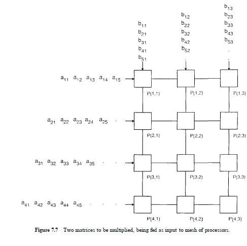
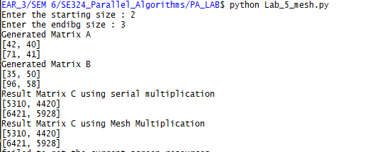
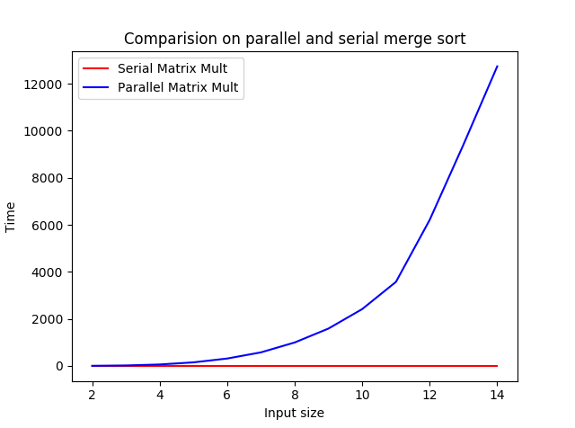

# AIM: To implement SIMD Matrix-Matrix multiplication using Mesh architecture

## Introduction and Theory

Matrix-Matrix Multiplication can be parallelized using the mesh architecture of SIMD models. This uses N2 processors where N is the input size of the two matrices. These are arranged into a N*N grid of processors connected to the neighbors. All of these are equidistant from each other to minimize the propagation losses.

The arrangement of the processors are as follows:



Elements a,, and b,, take m + k + n - 2 steps from the beginning of the computation to reach P(m, k). Since P(m, k) is the last processor to terminate, this many steps are required to compute the product. Assuming that m < n and k < n, procedure MESH MATRIX MULTIPLICATION therefore runs in time t(n) = O(n). Since p(n) = O(n2).

Thus theoretically the mesh approach is the most cost optimal and best possible method.

## Algorithm

```python
1. def MeshMMM(A, B, C):
2. 		for i = 1 to m do in parallel:
3. 			for j = 1 to k do in parallel:
4.				C[i][j] = 0
5.				while p[i][j] has two inputs a, b do:
6.					c[i][j] = c[i][j] + a*b
7.					if i < m then send b to p[i+1][j]
8.					if j < k then send a to p[i][j+1]
    
```

## Code

```python
# -*- coding: utf-8 -*-
"""
Spyder Editor

This is a temporary script file.
"""
import multiprocessing
import matplotlib.pyplot as plt
from util import GetMatrix
from Lab_2_matmult import Multiply
import time
def multiply(A, B,r_in, c_in, C):
    sum = 0
    for i in range(len(A)):
        sum += A[i] * B[i]
    C[c_in] = sum

def get_column(A, col_index):
    ans = []
    rows = len(A)
    for i in range(rows):
        ans.append(A[i][col_index])
    return ans


if __name__ == '__main__':
    
    st = int(input("Enter the starting size : "))
    ed = int(input("Enter the endibg size : "))
    s_x = []
    s_y = []
    p_x = []
    p_y = []
    for z in range(st, ed):
        
        A = GetMatrix(z)
        B = GetMatrix(z)
        C = []
        #Serial multiplication
        print("Generated Matrix A")
        for i in A:
            print(i)
        print("Generated Matrix B")
        for i in B:
            print(i)
        s = time.time()
        C = Multiply(A,B)
        e = time.time()
        print("Result Matrix C using serial multiplication")
        for i in C:
            print(i)
        s_x.append(z)
        s_y.append(e-s)
        
        # Parallel
        processes = []
        res = []
        output = []
        s  = time.time()
        for i in range(z):
            output.append([])
            processes.append([])
            res.append(multiprocessing.Array('i', z))
            for j in range(z):
                output.append(0)
                processes[i].append(
                    multiprocessing.Process(target=multiply, args=(A[i], get_column(B, j), i, j, res[i])))
                processes[i][j].start()

        for i in range(len(processes)):
            for j in range(len(processes[i])):
                processes[i][j].join()
        e = time.time()
        print("Result Matrix C using Mesh Multiplication")
        for i in res:
            print(i[:])
        p_x.append(z)
        p_y.append(e-s)

    for i in range(len(p_y)):
        p_y[i] = p_y[i] / 2*p_x[i]**2
    
    
    plt.plot(s_x,s_y, label="Serial Matrix Mult", color = 'red')
    plt.plot(p_x,p_y, label="Parallel Matrix Mult", color = 'blue')
    plt.xlabel('Input size')
    plt.ylabel('Time')
    plt.title("Comparision on parallel and serial merge sort")
    plt.legend()
    plt.show()
```

## Output



## Discussion

From the graph below we see that the time taken for parallel implementation grows nearly quadratic compared to serial for small inputs (up to 15x15 matrices). This is due to the overhead of creating N2 process, assigning them values and then running them, which on its own has the scheduling and other conflicts overheads.

At very high order of inputs, the parallel method begins to show much better results compared to the serial when the overhead costs outweigh the time takes by serial method



## Findings and learnings 

1. The parallel methods shows better performance at very high order of input
2. The initial overhead of process allocation and scheduling makes it impractical for small inputs
3. After n=10 the growth of parallel method is nearly o(n) which is expected.