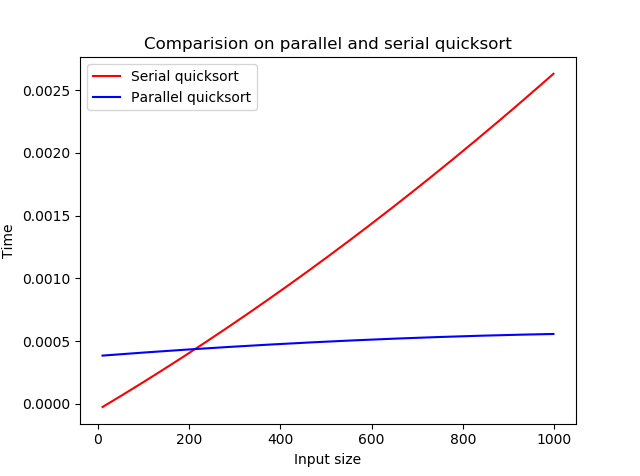
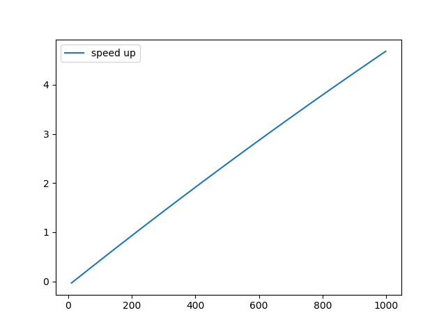

# AIM: To implement and analyze parallel quick sort 

## Introduction and theory

### Quicksort

Quicksort is a sorting algorithm whose worst-case running time is (*n*2) on an input array of *n* numbers. In spite of this slow worst-case running time, quicksort is often the best practical choice for sorting because it is remarkably efficient on the average: its expected running time is (*n* lg *n*), and the constant factors hidden in the (*n* lg *n*) notation are quite small. It also has the advantage of sorting in place (see page 3), and it works well even in virtual memory environments.

Quicksort, like merge sort, applies the divide-and-conquer paradigm. It has a three step process

**Divide: **The array *A*[*p . . r*\] is partitioned (rearranged) into two nonempty subarrays *A*[*p . . q*] and *A*[*q* + 1 . . *r*] such that each element of *A*[*p . . q*] is less than or equal to each element of *A*[*q* + 1 . . *r*]. The index *q* is computed as part of this partitioning procedure.

**Conquer: **The two subarrays *A*[*p . . q*\] and *A*[*q* + 1 . . *r*] are sorted by recursive calls to quicksort.

**Combine: **Since the subarrays are sorted in place, no work is needed to combine them: the entire array *A*[*p . . r*\] is now sorted.

### Parallel Quicksort

The parallel quick sort algorithm works by parallelizing the divide, and the partitioning steps. this makes the O(n) partition time an O(1) operation. The resulting algorithm is then O(logn).

The pivot selection is left to be something *unintuitive* because the creation and propagation of a random key would add a-lot of time overhead to the parallel algorithm.

<div style="page-break-after: always;"></div>

## Algorithm

### Serial Quicksort

```python
QUICKSORT(A; p; r)
    1 if p < r
    2 q = PARTITION(A; p; r)
    3 QUICKSORT(A; p; q - 1)
    4 QUICKSORT(A; q + 1; r)
```

```
PARTITION(A; p; r)
  1 x = A[r]
  2 i =  p - 1
  3 for j = p to r - 1
    4 if A[j] <= x
      5 i = i + 1
      6 exchange A[i] with A[j]
    7 exchange A[i + 1] with A[r]
  8 return i + 1
```

### Parallel Quick sort

There are N2 processors arranged as a Complete binary tree, each node does only the merge step while the leafs do partitioning.

```python
Parallel_QUICKSORT(A; p; r)
    1 if p < r
    2 q = PARTITION(A; p; r)
    3 call QUICKSORT(A; p; q - 1) on Processor Pi
    4 call QUICKSORT(A; q + 1; r) on Processor Pj
```

```
PARTITION(A; p; r)
  1 x = A[r]
  2 i =  p - 1
  3 for j = p to r - 1
    4 if A[j] <= x
      5 i = i + 1
      6 exchange A[i] with A[j]
    7 exchange A[i + 1] with A[r]
  8 return i + 1
```


Complexity: There is only cost i.e the data propagation  O(logn).
<div style="page-break-after: always;"></div>
## Code

```python
import threading as th
import time
import matplotlib.pyplot as plt
import numpy as np
from util import getarr
import random
mx_th = 1
def partition(arr, low, high):
    i = low - 1
    piv = arr[high]
    for j in range(low, high):
        if arr[j] <= piv:
            i += 1
            arr[i], arr[j] = arr[j], arr[i]
    arr[i+1], arr[high] = arr[high], arr[i+1]
    return i+1

def quicksort(arr, low, high, mode='s'):
    if mode == 's':
        if low < high:
            pi = partition(arr, low, high)
            quicksort(arr, low, pi-1)
            quicksort(arr, pi+1, high)
    elif mode == 'p':
        if low < high:
            global mx_th
            mx_th = max(mx_th, th.active_count())
            pi = partition(arr, low, high)
            p1 = th.Thread(target=quicksort, args=(arr,low,pi-1, 'p'))
            p2 = th.Thread(target=quicksort, args=(arr, pi+1, high, 'p'))

            p1.start()
            p2.start()
            p1.join()
            p2.join()

def main():
    global mx_th
    st = int(input("Enter the starting size : "))
    ed = int(input("Enter the endibg size : "))
    s_x = []
    s_y = []
    p_x = []
    p_y = []
    for z in range(st,ed):
        print(z)
        arr = getarr(z)
        print(arr)
        x = arr.copy()
        s_x.append(z)
        st = time.time()
        quicksort(x,0,len(x)-1)
        s_y.append(time.time()-st)
        print("Sorted using serial quicksort : ")
        print(x)

        y = arr.copy()
        p_x.append(z)
        st = time.time()
        quicksort(y, 0, len(y)-1, 'p')
        p_y.append((time.time() - st)/mx_th)
        print("Sorted using parallel quicksort : ")
        print(y)
        mx_th = 1
    s_fit = np.polyfit(s_x, s_y,deg=2)
    s_p = np.poly1d(s_fit)
    plt.plot(s_x,s_p(s_x), color = 'red', label="Serial quicksort")
    p_fit = np.polyfit(p_x, p_y,deg=2)
    p_p = np.poly1d(p_fit)
    # plt.plot(p_x,p_y, label="Parallel Matrix Vector Mult", color = 'blue')
    plt.plot(p_x,p_p(p_x), color = 'blue', label="Parallel quicksort" )
    plt.xlabel('Input size')
    plt.ylabel('Time')
    plt.title("Comparision on parallel and serial quicksort")
    plt.legend()
    plt.show()
    s_up = [s_y[i]/p_y[i] for i in range(len(s_x))]
    s_fit = np.polyfit(s_x, s_up,deg=2)
    s_p = np.poly1d(s_fit)
    plt.plot(s_x, s_p(s_x), label="speed up")
    plt.legend()
    plt.show()


if __name__ == '__main__':
    main()
            
```


<div style="page-break-after: always;"></div>
## Output


## Discussion

From the below graph we can see the algorithm indeed follows a Log(n) growth in time. and thus there is scope for parallelization to improve efficiency and run time.



and the speed up observed is:



## Findings and Learnings

1. The parallel quicksort algorithm works efficiently for very large inputs.
2. There is direct relation between the number of processors and the speedup.
3. Using a random pivot adds additional overhead and makes the parallel approach unfavorable.

