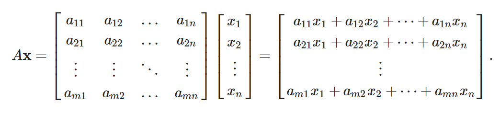

# AIM: To implement and analyze serial Matrix-Vector multiplication 

## Introduction and theory

The task of matrix-vector multiplication is widely used in the field of computer science especially in the field of scientific computing. It is also used in cognitive tasks like those in machine learning and other AI activities .Thus the need of an efficient algorithm to multiply matrices and Vectors is essential. The standard serial algorithm is O(n2) w.r.t to the input and this is also the best possible time for serial implementations.

The task is as follows:



This can be parallelized using the SIMD Linear array approach, where there are M processors arranged as a linear array. Each item takes O(m+n-1) steps to reach the last node. This is the most cost optimal approach possible.

the arrangement of processors is:


## Algorithm

```python
def Mat_Vec(M[m][n],v[n]):
1.	for i in to m do in parallel:
2.		out [i] = 0
3.		while Pi has 2 inputs a, b do
4.			out[i] += a * b
5. 			if i > 1 send u to Pi-1
6.	return res
```

Complexity: There is only 1 for loop thus O(n) for square matrix.

## Code

```python
import multiprocessing as mp
import threading as th
import time
import matplotlib.pyplot as plt
import numpy as np

def mult(A, u, V, idx):
    sum = 0
    for i in range(len(u)):
        sum += A[i]*u[i]
    V[idx] = sum
def main():
    z = int(input("Enter the input size : "))
    A = GetMatrix(z)
    u = GetVector(z)
    V = []
    print("Generated Matrix A")
    mat_print(A)
    print("Generated vector u")
    mat_print(u)
    C = Multiply(A,u)
    print("Result Vector V using serial multiplication")
    mat_print(C)

    Proc = []
    jobs = []
    V = []

    for i in range(z):
        V.append(0)
        thread = th.Thread(target=mult, args=(A[i],u, V, i))
        jobs.append(thread)
    for i in jobs:
        i.start()
    for i in jobs:
        i.join()
    print("Result Matrix C using Mesh Multiplication")
    mat_print(V)
        

if __name__ == '__main__':
    main()
            
```


## Output


## Findings and Learnings

1. The Matrix-Vector multiplication algorithm is a N2 algorithm w.r.t input size.
2. For the matrices and vectors to be multipliable their columns and rows need to be of same dimension.
3. for small inputs the serial implementation performs better due to the overheads of creating and assigning data to processes.

