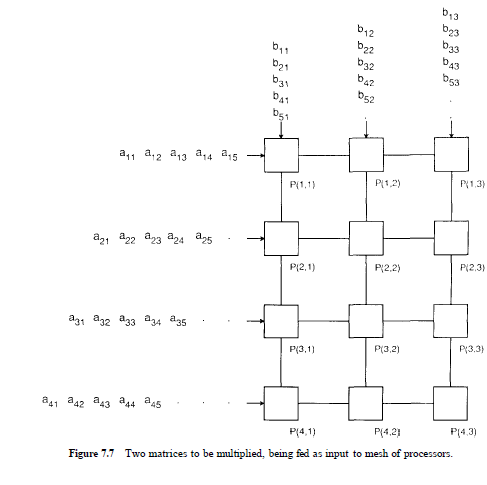
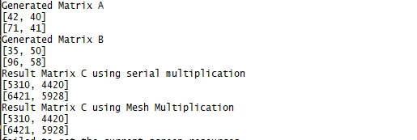

# AIM: To implement SIMD Matrix-Matrix multiplication using Mesh architecture

## Introduction and Theory

Matrix-Matrix Multiplication can be parallelized using the mesh architecture of SIMD models. This uses N2 processors where N is the input size of the two matrices. These are arranged into a N*N grid of processors connected to the neighbors. All of these are equidistant from each other to minimize the propagation losses.

The arrangement of the processors are as follows:



Elements a,, and b,, take m + k + n - 2 steps from the beginning of the computation to reach P(m, k). Since P(m, k) is the last processor to terminate, this many steps are required to compute the product. Assuming that m < n and k < n, procedure MESH MATRIX MULTIPLICATION therefore runs in time t(n) = O(n). Since p(n) = O(n2).

Thus theoretically the mesh approach is the most cost optimal and best possible method.

## Algorithm

```python
1. def MeshMMM(A, B, C):
2. 		for i = 1 to m do in parallel:
3. 			for j = 1 to k do in parallel:
4.				C[i][j] = 0
5.				while p[i][j] has two inputs a, b do:
6.					c[i][j] = c[i][j] + a*b
7.					if i < m then send b to p[i+1][j]
8.					if j < k then send a to p[i][j+1]
    
```

## Code

```python
import multiprocessing
import matplotlib.pyplot as plt
from util import GetMatrix
import Multiply
import time

def multiply(A, B,r_in, c_in, C):
    sum = 0
    for i in range(len(A)):
        sum += A[i] * B[i]
    C[c_in] = sum

def get_column(A, col_index):
    ans = []
    rows = len(A)
    for i in range(rows):
        ans.append(A[i][col_index])
    return ans


if __name__ == '__main__':
    
    z = int(input("Enter the input size : "))
        
    A = GetMatrix(z)
    B = GetMatrix(z)
    C = []
    #Serial multiplication
    print("Generated Matrix A")
    for i in A:
        print(i)
    print("Generated Matrix B")
    for i in B:
        print(i)
    C = Multiply(A,B)
    print("Result Matrix C using serial multiplication")
    for i in C:
        print(i)

    # Parallel
    processes = []
    res = []
    output = []
    for i in range(z):
        output.append([])
        processes.append([])
        res.append(multiprocessing.Array('i', z))
        for j in range(z):
            output.append(0)
            processes[i].append(
                multiprocessing.Process(target=multiply, args=(A[i], get_column(B, j), i, j, res[i])))
            processes[i][j].start()

    for i in range(len(processes)):
        for j in range(len(processes[i])):
            processes[i][j].join()
    print("Result Matrix C using Mesh Multiplication")
    for i in res:
        print(i[:])
```

## Output



## Findings and learnings 

1. The parallel methods shows better performance at very high order of input
2. The initial overhead of process allocation and scheduling makes it impractical for small inputs
3. After n=10 the growth of parallel method is nearly o(n) which is expected.