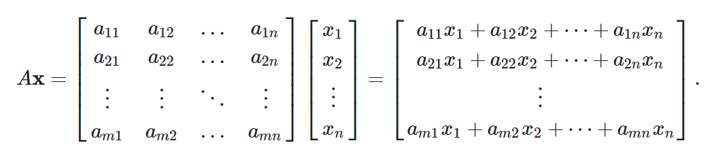

# AIM: To implement and analyze serial Matrix-Vector multiplication 

## Introduction and theory

The task of matrix-vector multiplication is widely used in the field of computer science especially in the field of scientific computing. It is also used in cognitive tasks like those in machine learning and other AI activities .Thus the need of an efficient algorithm to multiply matrices and Vectors is essential. The standard serial algorithm is O(n2) w.r.t to the input and this is also the best possible time for serial implementations.

The task is as follows:



This can beparallelized using the SIMD tree layout of processors, where there are P2 processors arranged as a complete binary tree. The time is reduced down toO(m-1 + log(n)) .

the arrangementof processors is:


### Explanation of the architecture:

- The leaf nodes get one element of the vector and the corresponding column of the matrix.
- The leaf nodes perform a multiplication operation and propagate the result to their parent node.
- The Interior nodes perform an addition operation and propagate the result to their parent node.
- The root node gives out the values of the final vector.

## Algorithm

```python
def Tree_MV_Mult(A, u, v):
  do 1 and 2 parallely:
    # step 1
    for i = 1 to n do in parallel:
      for j = 1 to m do:
        compute u[i] * A[i][j]
        send result to parent
    # step 2
    for i = n+1 to 2n-1 do in parallel:
      while P[i] has 2 inputs:
        compute sum of inputs
        if i < 2n-1:
          send result to parent
        else: produce output
```

Complexity: There is only 1 for loop thus O(log(n)) for square matrix.

## Code

```python
import threading as th
import time
import math
import matplotlib.pyplot as plt
import numpy as np
mx_th = 1
def tree_te_ply(vector, start, end, matrix, res):
    global mx_th
    mx_th = max(mx_th, th.active_count())
    if start > end:
        return
    if start == end:
        for i in range(len(matrix)):
            res[i] = vector[start] * matrix[i][start]
        return
    M = len(matrix)
    mid = math.floor((start + end) / 2)
    res1 = [0] * M
    res2 = [0] * M
    p1 = th.Thread(target=tree_te_ply, args=(vector, start, mid, matrix, res1))
    p2 = th.Thread(target=tree_te_ply, args=(vector, mid + 1, end, matrix, res2))
    p1.start()
    p2.start()
    p1.join()
    p2.join()    
    for i in range(M):
        res[i] = res1[i] + res2[i]
    return


def main():
    z = int(input("Enter the matrix size : "))
    A = GetMatrix(z)
    u = GetVector(z)
    V = []
    print("Generated Matrix A")
    mat_print(A)
    print("Generated vector u")
    mat_print(u)
    s = time.time()
    C = Multiply(A,u)
    e = time.time()
    print("Result Vector V using serial multiplication")
    mat_print(C)

    N = len(u)
    M = len(A)
    output = [0] * M
    strt = time.time()
    tree_te_ply(u, 0, N - 1, A, output)
    end = time.time()
    print("Result Vector V using tree multiplication")
    mat_print(output)    
    
if __name__ == '__main__':
    main()

            
```


## Output


## Findings and Learnings

1. The Matrix-Vector multiplication algorithm is a N2 algorithm w.r.t input size.
2. For the matrices and vectors to be multipliable their columns and rows need to be of same dimension.
3. for small inputs the serial implementation performs better due to the overheads of   creating and assigning data to processes.
4. The tree architecture when implemented as a software system adds unnecessary overheads and makes the use of this algorithm less favorable.